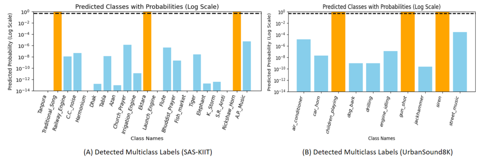

# Soundscapes in Spectrograms — Multilabel & Multiclass Audio Classification

This repository contains the implementation and experimental code for the research paper presented at:

**The 16th International IEEE Conference on Computing, Communication and Networking Technologies (ICCCNT)**

*The paper focuses on multilabel and multiclass classification of urban soundscapes using spectrogram-based deep learning models.*

---

## 📌 Paper Information

- **Title: Soundscapes in Spectrograms: Pioneering Multilabel
Classification for South Asian Sounds** [Paper not yet online]  
- **Conference:** ICCCNT 2026  
- **Authors:** Sudip Chakrabarty et al.  

---

## 🗂️ Repository Contents

| File | Description |
|------|-------------|
| `mel_spectrogram_extraction_urbansound8k.ipynb` | Preprocessing & Mel spectrogram extraction from UrbanSound8K dataset |
| `test_1D_CNN_Urban8k_NEWModel.ipynb` | 1D CNN model for multilabel/multiclass classification |
| `test3_1D_CNN_Urban8k_NewModel.ipynb` | Improved 1D CNN model with optimizations |
| `LSTM_OUTPUT.ipynb` | LSTM-based approach for sequence modeling of audio features |
| `detected.png` | Sample output of the classification model |

---

## 🧠 Methodology

- Audio preprocessing using **Mel Spectrograms**  
- Feature extraction for multilabel and multiclass classification  
- Model architectures: **1D Convolutional Neural Networks (CNNs)** and **LSTM networks**  
- Evaluation of models on **UrbanSound8K** dataset  
- Visualization of predictions using spectrogram overlays  

---
